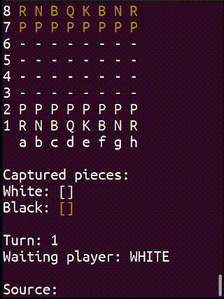
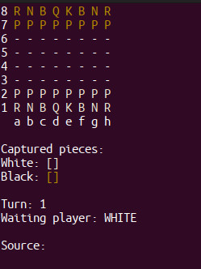
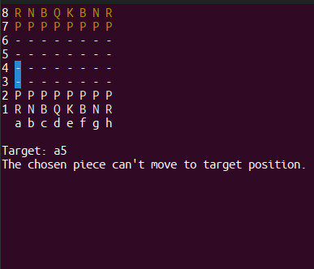
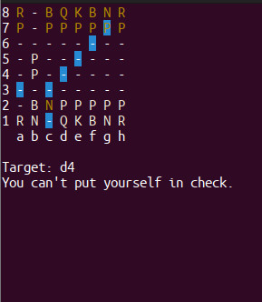

# Chess System Java

[](https://github.com/detds/chess-system-java/blob/main/LICENSE)

This is a simple terminal-based chess game implemented in Java. Players can enjoy a game of chess by inputting their moves via the terminal. The game displays the current state of the board, captures pieces for both white and black players, turn count, and the active player's turn.

 

# Table of Contents

- [Getting Started](#getting-started)
  - [Prerequisites](#prerequisites)
  - [Installation](#installation)
- [How to Play](#how-to-play)
  - [Chess Piece Notation](#chess-piece-notation)
  - [Move Notation](#move-notation)
  - [Gameplay](#gameplay)
- [Features](#features)
- [Game Screenshots](#game-screenshots)
- [Contributing](#contributing)
- [License](#license)


## Getting Started

### Prerequisites

- Java JDK (version 8 and higher)
- Terminal or Command Prompt

### Installation

1. Clone this repository to your local machine using:
   
   ```console
   $ git clone https://github.com/detds/chess-system-java.git
   ```
   
2. Navigate to the `src` directory:
   
    ```console
    $ cd chess-system-java/src/
    ```

3. Compile the Java source files:
    
    ```console
    $ javac application/Program.java
    ```

## How to Play

### Chess Piece Notation

In this chess program, the following piece abbreviations are used:

- `K` - King
- `Q` - Queen
- `R` - Rook
- `N` - Knight
- `B` - Bishop
- `P` - Pawn

These abbreviations represent the different chess pieces on the board.

### Move Notation

Moves are specified by providing the source position and the target position. For example, to move a pawn from a2 to a4, you would input: Source: a2, Target: a4.
Make sure to use the correct notation for the source and target positions to execute your moves successfully.

### Gameplay

1. Open your terminal and navigate to the `src` directory.
2. Run the compiled Java program:
    
    ```console
    $ java application.Program 
    ```
3. The chess board will be displayed.
4. Select the piece you want to move using the following format as an example:
   
   ```
   Source: a2
   ```

5. The game will show possible movements for the selected piece.
6. Input the target position for the selected piece using the following format as an example:
   
   ```
   Target: a4
   ```
7. The game will validate your move, update the board, and display the new state.
8. Continue playing by alternating turns and inputting your moves as described above.

## Features

- Terminal-based chess game.
- Interactive gameplay with player input.
- Displays the current state of the chess board.
- Keeps track of captures for both white and black players.
- Shows the turn count and the active player turn.
- Validates user input and updates the board accordingly.
- Display of possible movements for selected pieces.
- Clear and user-friendly interface.

## Game Screenshots




## Contributing
Contributions are welcome! If you find any issues or want to add enhancements, feel free to submit a pull request. Please follow the existing coding style and guidelines.

1. Fork the repository.
2. Create a new branch for your feature/bugfix: 
    ```console
    $ git checkout -b feature-new-feature
    ```
3. Commit your changes:
   ```console
   $ git commit -am "Add new feature"
   ```
4. Push to the branch:
   ```console
   $ git push origin feature-new-feature
   ```
5. Submit a pull request.

## License

[](https://github.com/detds/chess-system-java/blob/main/LICENSE)

This project is licensed under the MIT License.
